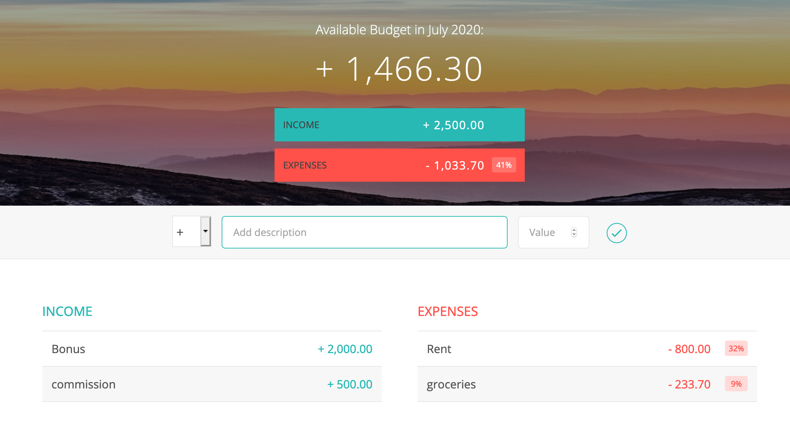

# BudgetBuilder

A budget calculator that allows a user to keep track of sources of income versus expenses.
It was created as practice for the udemy course: "The Complete Javascript Course 2020" and adapted as part of an exercise.



## Deployment and Usage

From the appropriate folder, opening the HTML file in a broswer window will link to the necessary JS and CSS assets.

Clone this repo to your desktop and run npm install to install all the dependencies:

```bash
# Clone this repository
$ git clone https://github.com/N0matic/BudgetBuilder

# Go into the repository
$ cd BudgetBuilder

# Run the app
$ open index.html 
```

## Running tests

There is a simple test function that can be used by calling the budgetController.testing function from within the console command prompt. This can be used to create test objects as incomes or expenses, for example:

```
budgetController.testing(1)
```
Will create an object in the terminal with new type, value, and percentage properties.


## Built With

* [Google APIs] (https://fonts.googleapis.com/css?family=Open+Sans:100,300,400,600) for the fonts
* [Ionic Framework] (http://code.ionicframework.com/ionicons/2.0.1/css/ionicons.min.css) for the icons used

Otherwise, the goal was to use as much Javascript as possible with as little else.

### Sources
Udemy.com: The Complete JavaScript Course 2020: Build Real Projects! Created by [Jonas Schmedtmann](https://github.com/jonasschmedtmann)

